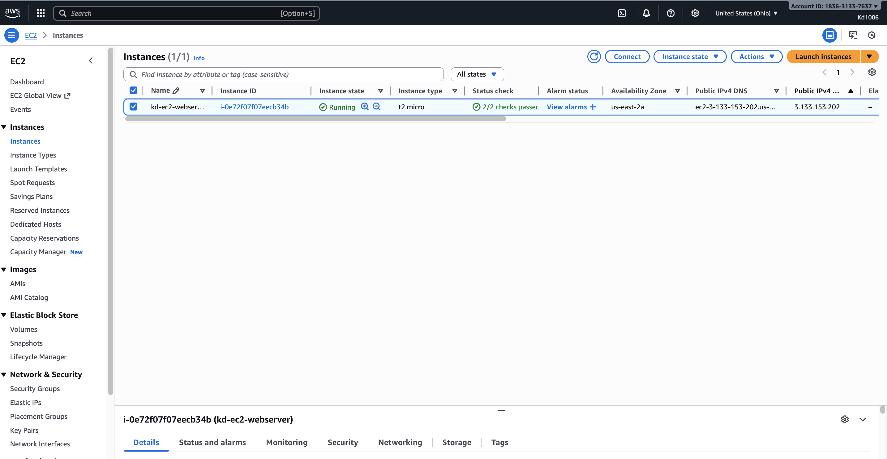
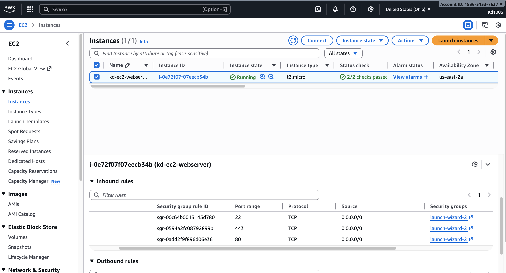
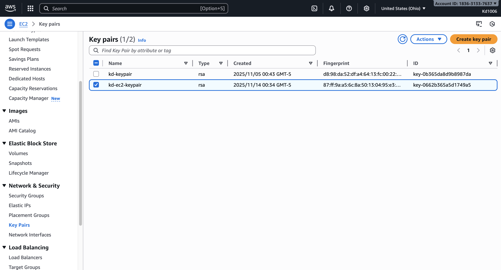
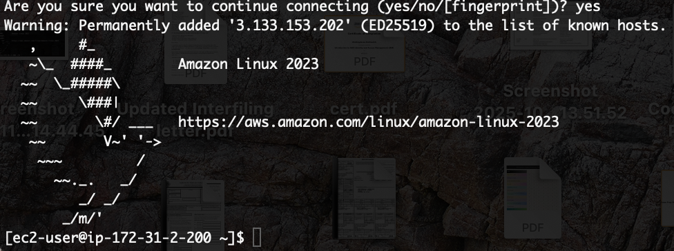
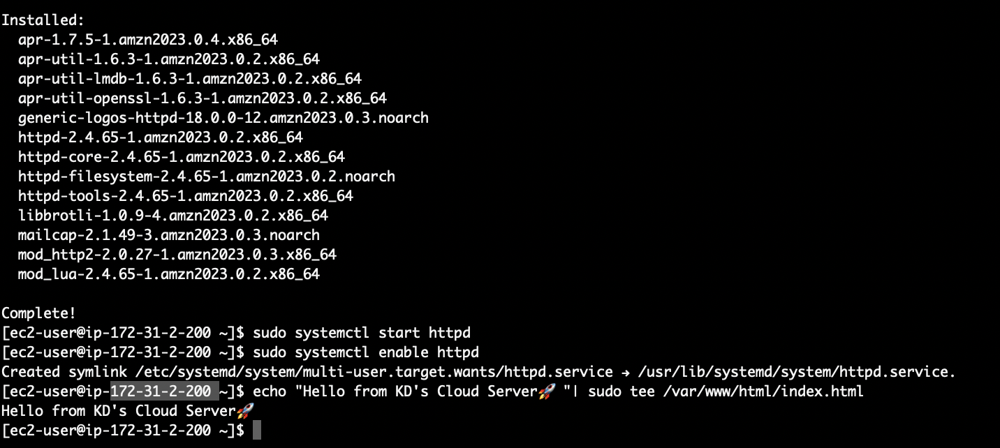
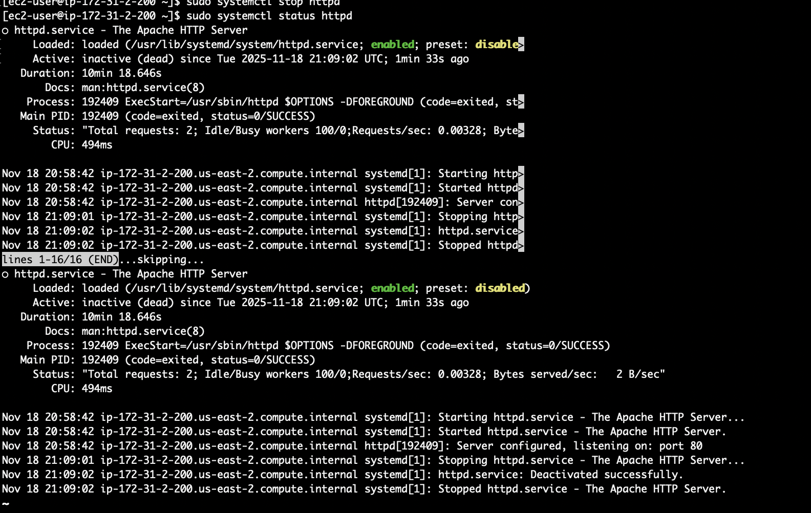
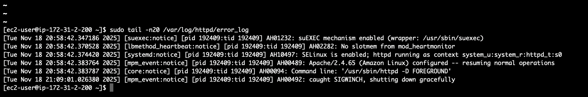
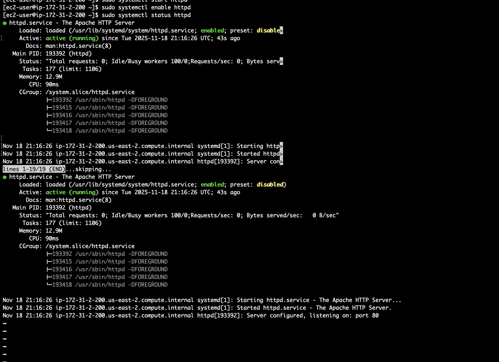

# aws-ec2-webserver-troubleshooting
Deploying a Linux web server on AWS EC2, breaking the service intentionally, diagnosing the outage, and restoring functionality using logs, systemctl and Linux troubleshooting.

## Tech stack
- AWS EC2 (Amazon Linux 2023)
- Apache HTTP Server
- Linux (systemctl, log analysis)
- SSH from macOS Terminal
- AWS Security Groups (SSH + HTTP)

## Steps performed

1.  **Deployed web server**
   - Launched a free-tier EC2 instance.
   - Installed Apache:
     ```bash
     sudo dnf install httpd -y
     sudo systemctl start httpd
     sudo systemctl enable httpd
     echo "Hello from KD's Cloud Server 🚀" | sudo tee /var/www/html/index.html
     ```
   - Verified the site in browser using the instance public IP.

2. **Simulated an outage**
   - Stopped Apache on purpose:
     ```bash
     sudo systemctl stop httpd
     ```
   - Confirmed the website became unavailable in the browser.

3. **Diagnosed the issue**
   - Checked service status:
     ```bash
     sudo systemctl status httpd
     ```
   - Viewed recent Apache logs:
     ```bash
     sudo tail -n 20 /var/log/httpd/error_log
     ```

4. **Restored service**
   - Restarted Apache and re-enabled it:
     ```bash
     sudo systemctl start httpd
     sudo systemctl enable httpd
     ```
   - Confirmed `Active: active (running)` in `systemctl` and that the website was reachable again.

## Root cause (RCA)
- **Cause:** Apache (`httpd`) service was stopped, so the EC2 instance was up but not serving HTTP.
- **Fix:** Restarted the service and enabled it to start automatically on boot.
- **Prevention ideas:** CloudWatch alarms for stopped services, periodic health checks, and systemd auto-restart options.

---

## Screenshots

### EC2 instance and networking




### SSH and web server setup




### Outage simulation and troubleshooting





### Service restored


